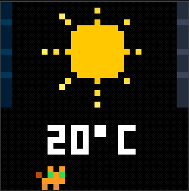
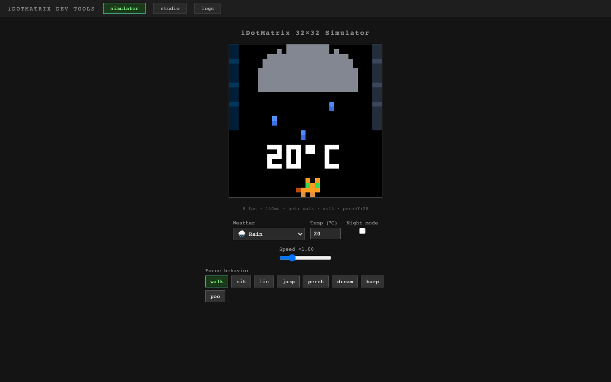
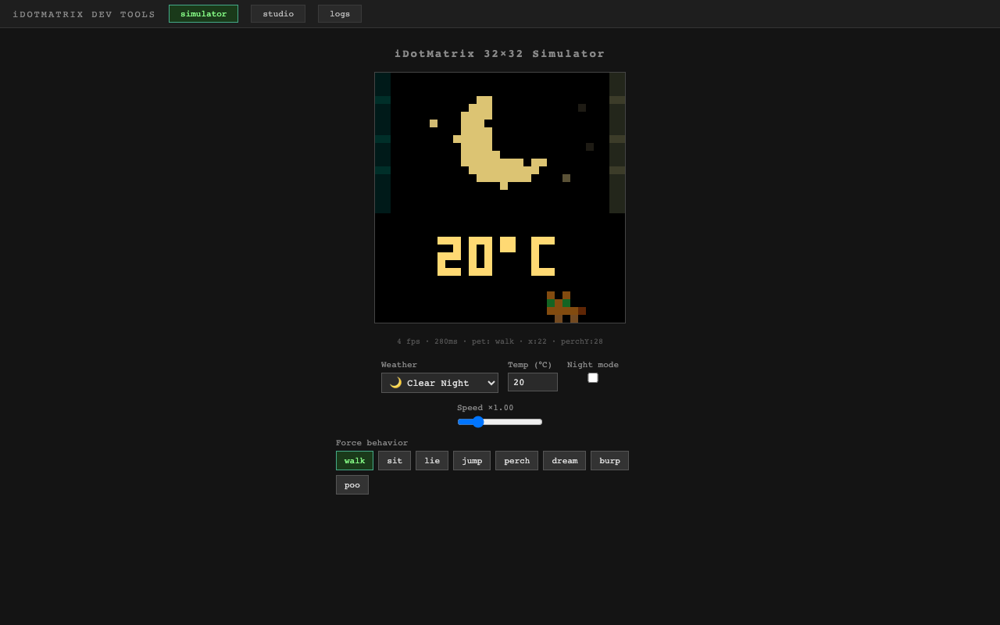
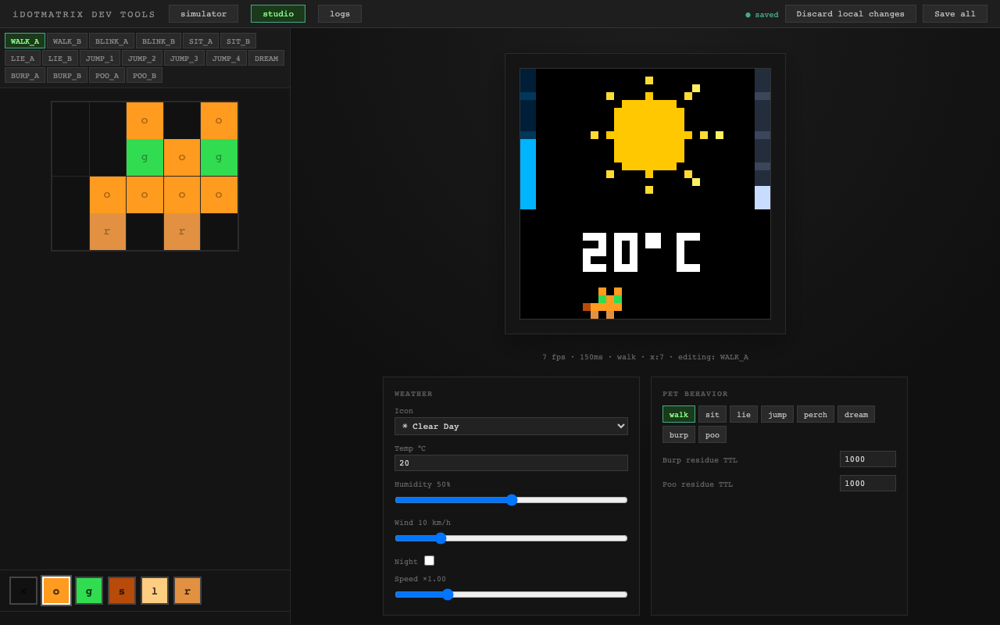

# iDotMatrix-Meoweather

Autonomous weather display for the **iDotMatrix 32×32 LED pixel panel** — no phone, no cloud, no interaction required. Current weather is fetched from the internet, rendered into a looping pixel animation, and pushed to the panel over Bluetooth Low Energy.

A pixel cat lives on the display and wanders around between weather updates.



---

## Features

### Weather display
- **9 animated weather scenes** — clear day, clear night, partly cloudy, cloudy, fog, rain, heavy rain, snow, thunderstorm
- **Smooth animations** — each scene loops with 6–12 frames; only changed pixels are sent over BLE, so the panel never flashes
- **Live temperature** — rendered in a custom pixel font
- **Night tinting** — colours shift warmer after sunset
- **Automatic refresh** — fetches weather from [Open-Meteo](https://open-meteo.com/) on a configurable interval (default: every 10 minutes)

### Pixel pet
A 5-pixel-wide cat overlaid on every frame. It has a full behaviour state machine:

| Behaviour | Description |
|-----------|-------------|
| walk | Strolls back and forth, blinks occasionally |
| sit | Sits and breathes |
| lie | Flops down |
| jump | Leaps and lands |
| perch | Climbs to a weather icon and sits on top |
| dream | Sleeps with floating dream bubbles |
| burp | Special move — leaves a little residue |
| poo | Special move — also leaves a little residue |

Day and night have different behaviour weights (night is calmer: more dreaming, less jumping).

### Control API & web UI

A local HTTP server (port 3000) exposes a REST API and a web UI for live control:

| Endpoint | Description |
|----------|-------------|
| `GET /api/health` | Current state: weather, pet behaviour, brightness, schedules |
| `GET /api/state` | Server-sent events stream of the health object |
| `GET /api/frame` | Server-sent events stream of the current rendered frame (base64 PNG) |
| `GET /api/logs` | Live log stream |
| `POST /api/control/brightness` | Set day/night brightness (0–100) |
| `POST /api/control/night-hours` | Configure dimming window |
| `POST /api/control/power-schedule` | Auto on/off by hour of day |
| `POST /api/control/behavior` | Force the pet into a specific behaviour |
| `POST /api/control/weather` | Override the weather (useful for testing) |
| `POST /api/control/pause` | Pause/resume rendering |

### Developer tools

`npm run dev:sim` opens a browser-based dev app with three tabs:

**Simulator** — live pixel preview with weather and pet controls, no hardware needed.

 

**Studio** — pixel sprite editor for the pet. Edit individual frames, preview them live in the simulator, and save directly to `src/sprites.ts`.



**Logs** — streamed output from the running app.

### Deployment

| Target | How |
|--------|-----|
| macOS (dev) | `npm run dev` — sidecar + TypeScript with hot-reload |
| macOS (background) | `npm run service:install` — launchd Login Item, auto-restarts on crash |
| Raspberry Pi | Docker Compose — two containers (`app` + `sidecar`), push-based deploy via GitHub Actions self-hosted runner |

---

## How it works

```
Open-Meteo API
     │ HTTPS
     ▼
┌─── TypeScript (Node.js) ──────────────────────┐
│  weather/   → WeatherSnapshot                  │
│  render/    → 32×32 RGB buffer → PNG           │
│  scheduler/ → every N minutes                  │
│  transport/ → POST PNG ──────────────┐         │
└──────────────────────────────────────┼─────────┘
                                       │ HTTP localhost
                                       ▼
                        ┌─── Python sidecar (bleak) ───┐
                        │  FastAPI: /display, /health   │
                        │  idotmatrix-api-client        │
                        └──────────────┬───────────────┘
                                       │ BLE GATT
                                       ▼
                              iDotMatrix 32×32 panel
```

The BLE protocol is undocumented and only exists as a reverse-engineered Python library. TypeScript handles everything else; the Python sidecar is the only part that touches Bluetooth. The two communicate over a local HTTP boundary: TypeScript sends a 32×32 PNG, the sidecar pushes it to the panel.

---

## Requirements

- **iDotMatrix 32×32 LED panel** (the AliExpress model, Bluetooth name `IDM_32*32_*`)
- **macOS or Linux host** within BLE range of the panel
- Node.js ≥ 20
- Python 3.11+
- macOS: Bluetooth permission granted to your terminal app (System Settings → Privacy & Security → Bluetooth)

---

## Quick start

### macOS

```bash
# 1. Clone and install
git clone https://github.com/brmk/iDotMatrix-Meoweather.git
cd iDotMatrix-Meoweather
npm install

# 2. Set up the Python sidecar
cd sidecar
python3 -m venv .venv
.venv/bin/pip install -r requirements.txt
cd ..

# 3. Configure
cp .env.example .env
# Edit LATITUDE, LONGITUDE, and optionally INTERVAL_SECONDS

# 4. Run
npm run dev
```

The TypeScript app and Python sidecar start together. The panel updates within a minute on the first cycle (BLE scan takes ~15 s on first connect).

### Browser simulator (no hardware needed)

```bash
npm install
npm run dev:sim
# Open http://localhost:8766
```

### Raspberry Pi (Docker Compose)

One-time host prep:

```bash
# On the Pi
sudo apt-get install -y docker.io docker-compose-plugin
sudo usermod -aG docker "$USER"
sudo loginctl enable-linger "$USER"
```

Deploy:

```bash
cp .env.example .env
# Edit LATITUDE, LONGITUDE
# Edit APP_IMAGE and SIDECAR_IMAGE to your GHCR namespace

./scripts/deploy-rpi.sh
./scripts/install-rpi-user-service.sh
```

---

## Configuration

All variables are read from `.env` (copy from `.env.example`). All have sensible defaults.

| Variable | Default | Description |
|----------|---------|-------------|
| `LATITUDE` / `LONGITUDE` | `49.5535` / `25.5948` | Your location |
| `INTERVAL_SECONDS` | `600` | Weather refresh interval |
| `SIDECAR_URL` | `http://127.0.0.1:8765` | Local sidecar address |
| `DEVICE_NAME_PREFIX` | `IDM` | BLE name prefix used for discovery |
| `SCAN_TIMEOUT` | `15` | BLE discovery timeout (seconds) |
| `DAY_BRIGHTNESS` | `80` | Panel brightness during the day (0–100) |
| `NIGHT_BRIGHTNESS` | `25` | Panel brightness at night (0–100) |

Brightness and night-hours settings persist across restarts in `runtime.json` and can be updated at runtime via the control API.

---

## Project layout

```
src/
  weather/     # Open-Meteo client → WeatherSnapshot
  render/
    icons/     # 9 weather icon animators
    text/      # Pixel font renderer
    pet/       # Pet sprite system and behaviour state machine
    scene/     # Frame composer, night tinting, temperature overlay
  scheduler/   # Interval loop
  transport/   # HTTP client for the sidecar
  control.ts   # REST API + SSE server
sidecar/       # Python BLE bridge (FastAPI + bleak)
dev/           # Vite + React dev app (simulator, studio, logs)
docs/          # Architecture, runbook, ADRs
```

---

## Tech stack

| Layer | Tech |
|-------|------|
| App | TypeScript / Node.js |
| BLE bridge | Python, FastAPI, [bleak](https://github.com/hbldh/bleak), [idotmatrix-api-client](https://github.com/markusressel/idotmatrix-api-client) |
| Weather data | [Open-Meteo](https://open-meteo.com/) (free, no API key) |
| Dev UI | Vite + React |
| Tests | Vitest (unit + deterministic render regression) |
| Production deploy | Docker Compose + GitHub Actions |

---

## License

MIT — see [LICENSE](LICENSE).
